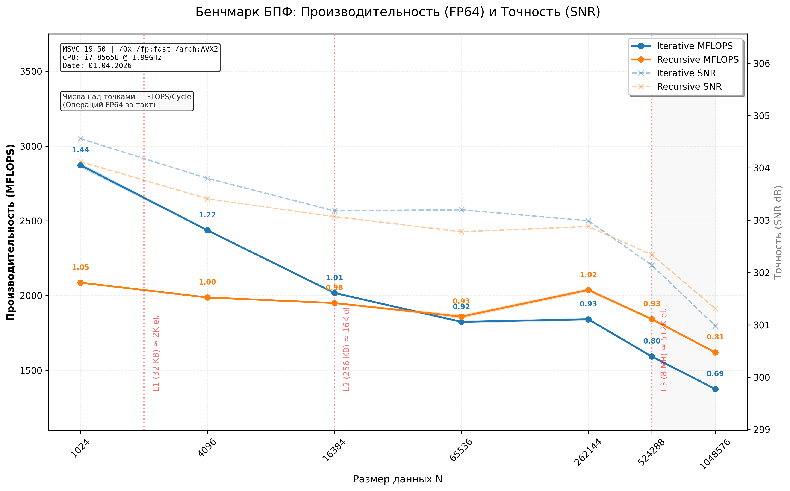

# Vibe FFT

Рекурсивная и итеративная SoA и AoS реализации быстрого преобразования Фурье (БПФ) с

* Автовекторизацией (AVX2, AVX512f) для GCC/Clang
* MSVC - для этого компилятора ситуация плохая - требуется ручная реализация на интринсиках...

### Требования

* **Стандарт:** C++23
* **Компилятор:** GCC 13+, Clang 16+ или MSVC 19.35+
* **Архитектура:** x86-64 с поддержкой AVX2 (v3)

### Сборка и запуск

Проект использует CMake и настроен на максимальную производительность (O3, AVX2, FMA):

```bash
mkdir build && cd build
cmake -DCMAKE_BUILD_TYPE=Release ..
cmake --build .
./fft_app
```

### FFT Performance & Accuracy Test, std::complex\<double\> (AoS)

* Компилятор MSVC 19.50 [скрипт python](./assets/bench_visualize.py).



### Методология тестирования производительности

Для обеспечения воспроизводимости и точности замеров в проекте используются следующие техники:

*   **Thread Affinity (Привязка к ядру):** Основной поток принудительно закрепляется за логическим ядром ЦПУ (`Core 0`).
*   **Warm-up (Разогрев):** Перед каждым замером выполняется серия итераций алгоритма «вхолостую». Turbo Boost отключен, стабилизированная частота ЦПУ - 1.99 ГГц.
*   **Метрики производительности:**
    *   **MFLOPS:** Рассчитывается на основе теоретической сложности БПФ: $10 \cdot N \log_2(N) + N$ операций на полный цикл (прямое + обратное преобразование + нормировка).
    *   **FLOPS/Cycle:** Количество операций с плавающей точкой FP64 на один такт процессора.
*   **Контроль точности:**
    *   **SNR (Signal-to-Noise Ratio):** Отношение энергии исходного сигнала к энергии ошибки восстановления (в дБ).
    *   **L-inf (Чебышёвская норма):** Максимальное абсолютное отклонение между исходным и восстановленным вектором. Значение `OK` выставляется при $L_{\infty} < \epsilon$, где допуск $\epsilon$ масштабируется согласно $O(\log_2 N)$ и учитывает использование агрессивных математических оптимизаций (`/fp:fast`).
