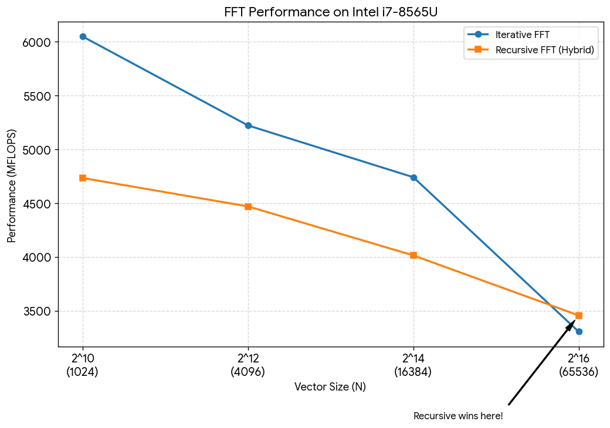

# Vibe FFT

Рекурсивная и итеративная реализации быстрого преобразования Фурье (БПФ) с автовекторизацией.

### Требования
* **C++23** (используются `std::ranges`, `std::views::zip`, `std::format`)
* **Компилятор:** GCC 13+, Clang 16+ или MSVC 19.35+
* **Архитектура:** x86-64 с поддержкой AVX2 (v3)

### Сборка и запуск

Проект использует CMake и настроен на максимальную производительность (O3, AVX2, FMA):

```bash
mkdir build && cd build
cmake -DCMAKE_BUILD_TYPE=Release ..
cmake --build .
./fft_app
```

### FFT Performance & Accuracy Benchmark

**Hardware & Environment:**
* **CPU:** Intel(R) Core(TM) i7-8565U @ 1.80GHz (Turbo Boost up to 1.99 GHz during test)
* **Compiler:** Microsoft Visual C++ 19.50.35721.0
* **Architecture Flags:** `/std:c++latest /arch:AVX2 /Ox`

| Algorithm | N | Cycle (ms) | MFLOPS | SNR dB | L-inf | Stat |
| :--- | :---: | :---: | :---: | :---: | :---: | :---: |
| **Iterative** | 1024 | 0.0171 | 6048.9 | 304.6 | 1.6e-12 | OK |
| **Recursive** | 1024 | 0.0218 | 4735.0 | 304.1 | 2.0e-12 | OK |
| | | | | | | |
| **Iterative** | 4096 | 0.0949 | 5223.2 | 303.8 | 2.3e-12 | OK |
| **Recursive** | 4096 | 0.1108 | 4471.3 | 303.4 | 2.3e-12 | OK |
| | | | | | | |
| **Iterative** | 16384 | 0.4871 | 4742.2 | 303.2 | 2.6e-12 | OK |
| **Recursive** | 16384 | 0.5752 | 4016.2 | 303.1 | 2.3e-12 | OK |
| | | | | | | |
| **Iterative** | 65536 | 3.1898 | 3307.9 | 303.2 | 2.6e-12 | OK |
| **Recursive** | 65536 | 3.0502 | **3459.2** | 302.8 | 2.6e-12 | OK |



### Методология тестирования

Для обеспечения воспроизводимости и точности замеров использовались следующие техники:

*   **Thread Affinity (Привязка к ядру):** Основной поток принудительно закрепляется за конкретным логическим ядром ЦПУ (`core 0`). Это исключает накладные расходы на переключение контекста ОС и минимизирует влияние динамического изменения частот других ядер.
*   **Warm-up (Разогрев кэша):** Перед каждым замером выполняется 5 итераций алгоритма «вхолостую». Это позволяет прогреть кэши процессора (L1/L2) и стабилизировать частоту CPU (Turbo Boost).
*   **Метрики производительности:**
    *   **MFLOPS:** Рассчитывается на основе сложности БПФ: $10 \cdot N \log_2(N) + N$ операций на полный цикл (прямое + обратное преобразование + нормировка).
    *   **Cycle (ms):** Среднее время выполнения полного цикла за 500–5000 итераций в зависимости от размера $N$.
*   **Контроль точности:**
    *   **SNR (Signal-to-Noise Ratio):** Отношение энергии исходного сигнала к энергии ошибки восстановления.
    *   **L-inf (Чебышёвская норма):** Максимальное абсолютное отклонение между исходным и восстановленным вектором. Значение `OK` выставляется при $L_{\infty} < \epsilon$, где допуск $\epsilon$ масштабируется согласно $O(\log_2 N)$.
